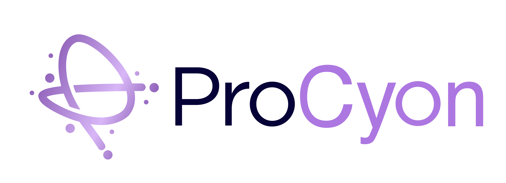

# ProCyon: A multimodal foundation model for protein phenotypes


ProCyon is an open-source model for predicting protein phenotypes across scales.
This repository provides the official implementation of the model as described in our [overview page](https://github.com/mims-harvard/ProCyon) and our [paper](https://www.biorxiv.org/content/10.1101/2024.12.10.627665v1).
Our associated HuggingFace collection containing model weights and datasets can be found at the following links:

- Dataset: [ProCyon-Instruct](https://huggingface.co/datasets/mims-harvard/ProCyon-Instruct)
- Full model: [ProCyon-Full](https://huggingface.co/mims-harvard/ProCyon-Full)
- Benchmarking model: [ProCyon-Split](https://huggingface.co/mims-harvard/ProCyon-Split)
- Binding prediction model: [ProCyon-Bind](https://huggingface.co/mims-harvard/ProCyon-Bind)

## Installation
Requirements:
- CUDA toolkit, particularly `nvcc`

We recommend installing with [uv](https://docs.astral.sh/uv/), but install can also be done via `pip` alone. The `procyon` package used to interact with pre-trained models or train new models can be installed via
```
cd /path/to/ProCyon

# RECOMMENDED: use uv to install. Two options depending on whether
#              you want to use the default .venv virtual env that
#              uv will create
# OPTION 1: let uv create and manage the virtual enviroment, requires
#           uv to already be installed
uv sync --extra build
uv sync --extra build --extra compile
uv pip install -e .
source .venv/bin/activate

# OPTION 2: create virtual environment with choice of name and path
python3 -m venv ./procyon_venv
source ./procyon_venv/bin/activate
python3 -m pip install uv
uv pip install -r pyproject.toml --extra build
uv pip install -r pyproject.toml --extra build --extra compile
uv pip install -e .

# OR if omitting uv
python3 pip install -e .
```
Installation with `uv` should take less than 10 minutes, depending on the
speed of your internet connection for downloading packages.

In addition to the package code, ProCyon also requires pre-trained weights for associated
models (e.g. Llama-3, ESM2) as well as access to the ProCyon-Instruct dataset.
You'll need to request access to the LLaMA-3 model through the model page [here](https://huggingface.co/meta-llama/Meta-Llama-3-8B).
These dependencies
will all be stored in a single directory, which we denote `DATA_DIR`.

```
DATA_DIR=/path/to/data
mkdir $DATA_DIR
cd $DATA_DIR

# Clone ProCyon-Instruct dataset from HuggingFace
git clone git@hf.co:datasets/mims-harvard/ProCyon-Instruct

# Clone model weights for associated Llama models from HuggingFace
# Llama-3-8b for ProCyon-Full
cd /path/to/llama3/
# Ensure you've signed up for LLaMA-3 access
git clone https://huggingface.co/meta-llama/Meta-Llama-3-8B
echo "LLAMA3_PATH=/path/to/llama3/Meta-Llama-3-8B" >> .env

# Llama-2-7b for ProCyon-Split
cd ../llama-2-7b-hf
git clone git@hf.co:meta-llama/Llama-2-7b-hf

# Add a `.env` file which the `procyon` package will use to find the `DATA_DIR`
cd /path/to/ProCyon
echo "DATA_DIR=\"$DATA_DIR\"" > .env
echo "HOME_DIR=\"$(pwd)\"" >> .env
```

**Version note**: We are aware of a bug where having `transformers>4.31.0` changes generated model outputs. Please ensure your `transformers` version is set to 4.31.0 (as in environment requirements) for inference of ProCyon.

## Examples
For the core capabilities of ProCyon models, please see the provided demo
notebooks. Both examples should run in less than 5 minutes depending on the
speed of your GPU.
- [Phenotype generation](https://github.com/mims-harvard/ProCyon/blob/main/examples/phenotype_generation.ipynb)
- [Retrieval](https://github.com/mims-harvard/ProCyon/blob/main/examples/retrieval.ipynb)

To see how to perform benchmarking runs comparing the performance of ProCyon models to
various other baselines and models, please see the
[example configs and scripts](https://github.com/mims-harvard/ProCyon/blob/main/examples/evaluation)
or the [evaluation README](https://github.com/mims-harvard/ProCyon/blob/main/procyon/evaluate/README.md).

For details on how to reproduce the various experiments and results in our manuscript, please see
the [reproducibility README](https://github.com/mims-harvard/ProCyon/blob/main/examples/paper_analyses/README.md).

For details on training a ProCyon model and example scripts, please see the [training README](https://github.com/mims-harvard/ProCyon/tree/main/examples/training/README.md).

## Citation
```
@article {Queen2024.12.10.627665,
  author = {Queen, Owen and Huang, Yepeng and Calef, Robert and Giunchiglia, Valentina and Chen, Tianlong and Dasoulas, George and Tai, LeAnn and Ektefaie, Yasha and Noori, Ayush and Brown, Joseph and Cobley, Tom and Hrovatin, Karin and Hartvigsen, Tom and Theis, Fabian and Pentelute, Bradley L. and Khurana, Vikram and Kellis, Manolis and Zitnik, Marinka},
  title = {ProCyon: A multimodal foundation model for protein phenotypes},
  elocation-id = {2024.12.10.627665},
  year = {2024},
  doi = {10.1101/2024.12.10.627665},
  URL = {https://www.biorxiv.org/content/early/2024/12/15/2024.12.10.627665},
  eprint = {https://www.biorxiv.org/content/early/2024/12/15/2024.12.10.627665.full.pdf},
  journal = {bioRxiv}
}
```
